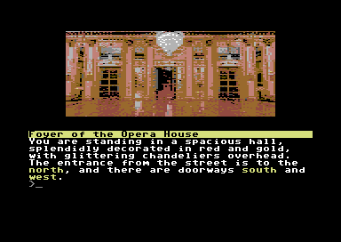

# Cloak of Darkness [C64]
A **Cloak of Darkness** implementation for C64 using my WIP Interactive Fiction Engine **storytllr64**

**Cloak of Darkness** (originally made by **Roger Firth** - https://www.ifwiki.org/Roger_Firth) is like a *Hello World* project for an Interactive Fiction engine. It's a classic (really) short story, realized by hundred of developers using several different languages. So it was an easy choice to use it to test the native C64 graphic text adventure I'm working on (with the hope to realize a bigger game).

To build this game you need **CC65** (https://www.cc65.org/)

A couple of notes: 
  - the compiled script code is inside **storytllr_data.h** (**include_storytllr.c** is the script player). Being still a WIP at the moment nor the compiler nor its documentation will be publicly available (sorry) but I think it could be in the future (at least in binary format).
  - during the build in the makefile there's a call to a .bat file to add images to the final .d64 - you need to change that part if you are not using a Windows OS (to call a .sh instead)

You can find the game page here (it may be an older versione, compared to script/code here): https://marcogiorgini.itch.io/cloak-of-darkness-c64
